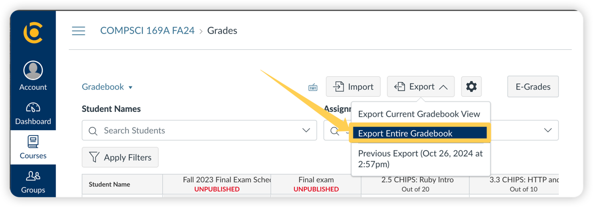

# CS169A Quiz Score Upload & Report Script

A script to upload CS169A PrairieLearn quiz scores to bCourses and generate insightful reports for course administration.

## Features
- **Gradebook Update**: Merges the existing bCourses gradebook with PrairieLearn quiz scores using a left join to create an updated gradebook.
- **Quiz Participation Report**: Generates a report listing students who haven't taken quizzes.
- **Anomaly Detection**: Identifies inconsistencies, such as students present in quiz scores but missing from bCourses due to mismatched email addresses.
- **Separate Logging**: Logs are saved to a `script.log` file, ensuring that reports remain clean and free from log entries.
- **Automated Testing**: Includes a test script to verify the correctness of report generation and gradebook updates without affecting your working directories.

## Requirements
- **Python 3**
- **Pandas** library

## Installation

1. **Install Python 3**

2. **Install Pandas**
   ```sh
   pip install pandas
   ```

## Usage

### 1. **Obtain Required CSV Files**
   - **Quiz Scores CSV from PrairieLearn**: Download the quiz score CSV file from PrairieLearn.

   - **Gradebook CSV from bCourses**: Download the latest gradebook CSV file from bCourses.

### 2. **Run the Script**
   ```sh
   python3 update_gradebook_quiz_score.py <prairielearn_quiz_score_csv> <bcourses_gradebook_csv> --output-dir <output_directory>
   ```
   **Example:**
   ```sh
   python3 update_gradebook_quiz_score.py CS_169_Fall-2024_Q3_scores.csv 2024-10-26T1436_Grades-COMPSCI_169A_FA24.csv --output-dir ./output
   ```

   **Parameters:**
   - `<prairielearn_quiz_score_csv>`: Path to the PrairieLearn quiz scores CSV file.
   - `<bcourses_gradebook_csv>`: Path to the bCourses gradebook CSV file.
   - `--output-dir <output_directory>`: (Optional) Directory to save the updated gradebook and reports. Defaults to `output` if not specified.

### 3. **Output Files**
   - **[updated_gradebook_with_quiz_score.csv](tests%2Fdata%2Fexpected_output_sanitized%2Fupdated_gradebook_with_quiz_score.csv)**: The merged and updated gradebook containing quiz scores.
   - **[reports.txt](tests%2Fdata%2Fexpected_output_sanitized%2Freports.txt)**: A detailed report listing students who haven't taken quizzes and any anomalies detected.
   - **[script.log](tests%2Fdata%2Fexpected_output_sanitized%2Fscript.log)`script.log`**: A log file capturing the script's execution details for troubleshooting and auditing purposes.

### 4. **Upload Updated Gradebook to bCourses**
   - Upload the `updated_gradebook_with_quiz_score.csv` back to bCourses. bCourses will display a preview of the changes, allowing you to verify the updates before they take effect.


## Testing

Ensure the script works correctly without affecting your working directories.

1. **Prepare Test Files**
   - Place your test input files:
     - `data/for_pr/tests/data/input_sanitized/sanitized_student_gradebook.csv`
     - `data/for_pr/tests/data/input_sanitized/sanitized_quiz_data.csv`
   - Ensure expected output files are available:
     - `data/for_pr/tests/data/expected_output_sanitized/reports.txt`
     - `data/for_pr/tests/data/expected_output_sanitized/updated_gradebook_with_quiz_score.csv`

2. **Run the Test Script**
   ```sh
   python3 test_update_gradebook.py
   ```
   - The test script uses a temporary directory to generate output files and compares them against the expected results.
   - It will report any discrepancies, ensuring your script functions as intended.
