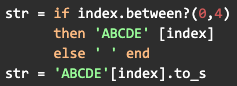

# Module 1 Self-Checks

**Self-Check 1.2: Software Development Processes: Plan and Document**

For which of the following might Plan-and-Document approaches be a poor fit

(x) User-facing app for an experimental rideshare service
( ) Embedded software for medical device
( ) Financial reporting app for a startup
( ) None of the above

[[Since the app is experimental, it will likely be going through change all the time, which is better suited for Agile]]

---

**Self-Check 1.3: Software Development Processes: The Agile Manifesto**

A major difference between Agile and P&D methodologies is that…

(x) Agile visits every phase of the software lifecycle during every iteration
( ) Agile does not use requirements
( ) Agile does not measure progress against an overall plan
( ) You can build SaaS apps using Agile, but not with Plan-and-Document

---

**Self-Check 1.4: Software Quality Assurance: Testing**

In general, which statement regarding the relationship between bug fix costs and enhancement costs is most accurate?

(x) $(Bug Fixing) = ~2-3x $(Enhancing)
( ) $(Enhancing) = ~2-3x $(Bug Fixing)
( ) $(Bug Fixing) = $(Enhancing)

[[Bug fixing is much more expensive than enhancement, which is why preservation of legacy code is important!]]

---

**Self-Check 1.5: Productivity: Conciseness, Synthesis, Reuse, and Tools**

If we are going for “Clarity via conciseness”, then:

(x) The first version is preferable
( ) The second version is preferable
( ) Either version is equally good.

[[When writing code, err on the side of writing something that is simple to implement and simple for co-workers to implement. It’s good for code to be compact, but if it gets so compact that it requires extra work to decipher, then it may be too concise at the cost of clarity.]]

---

**Self-Check 1.6: SaaS and Service Oriented Architecture**

The inability of one service to directly access another service's data is a characteristic of:

(x) Service-oriented architecture
( ) The Rails framework
( ) Object-oriented programming
( ) Agile development

[[The trademark of service oriented architecture is that services are self contained, and how it works is a black box to the user or data being submitted to it. As a result, the service should not be able to directly access another service in an SOA setting, as that would imply that the service accessing the other service’s data directly knows its inner workings.]]

---

**Self-Check 1.7: Deploying SaaS: Cloud Computing**

Which statement about private data centers vs. public utility computing (such as AWS) is true?

(x) Private data centers may be the only option for apps subject to government regulation
( ) Private data centers are not shared by multiple companies / competitors
( ) Private data centers are inherently more secure than public utility computing
( ) Private data centers could match the cost of public utility computing if they just used the same type of hardware and software

[[Private data centers are often shared by multiple customers, but they cannot match the cost of public utility computing simply because of how much fewer customers there are for private data centers. Often times, the staff and utility used for both public and private data centers are the same, so there’s nothing inherently more secure about a data center being private.]]

---

**Self-Check 1.8: Deploying SaaS: Browsers and Mobile**

Which of the following is false when considering using a CSS framework?

(x) For most cases, it's better to develop a CSS framework from scratch than to use an existing one.
( ) Good frameworks provide responsive behavior that adapts the webpage content to different display sizes (i.e. phone vs. computer)
( ) Good frameworks provide accessibility support for users with disabilities; this support can be activated by assistive technologies.
( ) Good frameworks usually write assets in a hierarchical fashion, with high level components being a combination of multiple HTML elements.

[[A good framework provides responsive behavior, accessibility support, and hierarchical CSS as described in the answer choices. On the other hand, it's recommended to use an existing CSS Framework as opposed to writing one for scratch. Most existing, popular frameworks should serve the aforementioned purposes, and writing one from scratch takes a significant amount of time.]]

---

**Self-Check 1.9: Beautiful vs. Legacy Code**

Which are TRUE regarding refactoring?

(x) It often results in changes to the test suite
( ) It usually results in fewer total lines of code
( ) It should not cause existing tests to fail
( ) It addresses explicit (vs. implicit) customer requirements

[[Refactoring code may often result in more lines, especially if debugging or writing more comprehensible code is involved. Refactoring sometimes addresses customer requirements, but that is not the only reason for it. Refactoring usually results in changes that are propagated and reflected by updates to the testing suite.]]

---

**Self-Check 1.10: How to Have a Bad Experience In This Course**

Out of the following approaches, which is NOT one of the recommended attitudes or perspectives towards achieving the desired outcomes of this course.

(x) This class should be studied as a step by step recipe for building Software as a Service applications.
( ) This class provides skills and points that will make you a sought after software engineer because you're able to learn and productively use new frameworks and tools rapidly.
( ) You'd like to build reliable software.
( ) You want to understand how certain, current technologies are the way they are, and what decisions in the history of software engineering led to their current states.

[[It's with no doubt a plus to know how to build SaaS applications with specific languages and frameworks. However, there are so many tools out there that covering them in a single course would not be feasible. Also, it's likely that your work will require you to dig into tools you may have never encountered before. Therefore, the goal of this class is geared towards introducing you to the methodologies and approaches of a great software engineer that can be applied indepednent of the actual tools you end up working with!]]
