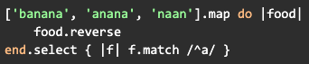

# Module 2 Self-Checks

**Self-Check 2.1: Learning to Learn Languages and Frameworks**

By following certain naming rules, you will not need to provide configuration files that explain which classes in your app are responsible for which database table. This practice is based on the principle of:

(x) Convention over Configuration
( ) Abstraction and Encapsulation
( ) Package Management
( ) Configuration Management

[[Convention over configuration refers to a language design choice meant to reduce the amount of manual coding a developer has to do (i.e. connect a class to a database) by replacing manual configuration tasks with automated processes that can be executed from convention, without needing manual intervention.]]

---

**Self-Check 2.2: Pair Programming**

Which statement best describes how pair programming should be done?

( ) Driver and observer should choose roles and stick to them throughout one pairing session
(x) The driver works on task at hand, the observer comments and thinks about next tasks
( ) Promiscuous pairing is valuable because it will alleviate the shortage of programmers

[[It’s important that both participants are exposed to both roles, and therefore, get to understand the code from both angles. Relegating duties entirely to one person is less conducive to helping programmers develop a comprehensive understanding of the code.]]

---

**Self-Check 2.3: Introducing Ruby, an Object-Oriented Language**

Which ones are correct: (a) my_account.@balance (b) my_account.balance (c) my_account.balance()

(x) (b) and (c)
( ) All Three
( ) Only (b)
( ) (a) and (b)

[[In Ruby, the @ symbol is used to specify a field within the definition of a class. However, when it comes to dereferencing a field of an object of that class, we use dot notation, not the @ symbol. The reason both b and c are correct is that, as you may recall, everything in Ruby is an object.]]

---

**Self-Check 2.4: Ruby Idioms: Poetry Mode and Blocks**

Which string will NOT appear in the result?

(x) naan
( ) ananab
( ) anana
( ) The above code won't run due to syntax errors

[[Feel free to run this code segment in a Ruby compiler to see the output. The "map" function is similar to an iterator for a sequential object. The "select" clause filters out the strings not matching the regular expression pattern.]]

---

**Self-Check 2.6: Gems and Bundler: Library Management in Ruby**

Which of the library-management files in a Rails app should be versioned?

(x) Both Gemfile and Gemfile.lock
( ) Only Gemfile
( ) Only Gemfile.lock
( ) Neither Gemfile nor Gemfile.lock

[[When deciding what files should be recorded in version control, keep in mind that the top priority is to reduce variability as much as possible. The Gemfile lists the required dependencies, but the Gemfile.lock specifies the specific versions of each dependency that is in use. Therefore, to avoid version conflicts, committing both the Gemfile and Gemfile.lock is recommended.]]
