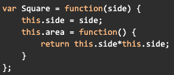
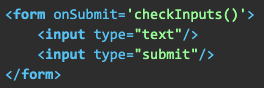

# Module 6 Self-Checks

**Self-Check 6.1: JavaScript: The Big Picture**

Client-side JavaScript code can interact with HTML page elements because this functionality: a. is part of the JavaScript language b. is part of the browser c. is provided by the JSAPI

(x) (b) and (c)
( ) (a) only
( ) (a) and (b) only
( ) only (a), (b) and (c)

[[The browser has the functionality of manipulating and displaying HTML page elements; the JSAPI exposes the data structures and functions that implement this functionality to JavaScript.]]

---

**Self-Check 6.2: Introducing ECMAScript**

Which is NOT true about functions in JavaScript?

(x) They can execute concurrently with other functions
( ) They can be anonymous
( ) They always return a value, even if that value might be undefined
( ) They can be passed a function as an argument

[[JavaScript is single-threaded so functions execute one at a time. All the other statements are true.]]

---

**Self-Check 6.3: Classes, Functions and Constructors**

Which call will evaluate to 9?

(x) var p=Square; (new p(3)).area()
( ) Square(3).area
( ) Square(3).area()
( ) (new Square(3)).area

[[This works because “p” just refers to the same function object as “Square”, so we can call this 'constructor-style' function using “new” and then call the 'instance method' “area()” on it.]]

---

**Self-Check 6.4: The Document Object Model (DOM) and jQuery**

When using JavaScript for client-side form validation, which is NOT true?

(x) The server doesn't have to repeat validations already performed by JavaScript
( ) JavaScript code can inspect DOM element attributes to see what the user typed
( ) JavaScript code can prevent the "Submit" button from submitting the form
( ) Some validations may be impractical to perform on client so must be done on server

[[As described in the answers]]

---

**Self-Check 6.5: The DOM and Accessibility**

Which of the following practices contribute to greater accessibility and usability?

(x) All of the statements
( ) Use consistent icons, labels, navigation
( ) Have easily readable fonts
( ) Pay attention to colors and contrasts

[[All three points are important when it comes to designing an application that is friendly to users with visual impairments.]]

---

**Self-Check 6.6: Events and Callbacks**

If this form is loaded in a non-JS-aware browser:

(x) The form will be submitted, but without inputs being checked
( ) Browser will complain about malformed HTML when page is loaded (server should respect browser version and not send JavaScript)
( ) Browser will complain, but only when form's Submit button clicked
( ) Nothing will happen when submit button is clicked (form won't be submitted)

[[The JavaScript-specific content will simply be ignored, in this case the specification of a handler for the form's submit event, and the form will behave just as if JavaScript didn't exist.]]

---

**Self-Check 6.7: AJAX: Asynchronous JavaScript And XML**

Which is FALSE concerning AJAX/XHR vs. non-AJAX interactions?

(x) If the server fails to respond to an XHR request, the browser's UI will freeze
( ) AJAX requests can be handled with their own separate controller actions
( ) In general, the server must rely on explicit hint (like headers) to detect XHR
( ) The response to an AJAX request can be any content type (not just HTML)

[[Although JavaScript is single-threaded, XHR is asynchronous--it returns as soon as the XHR request is queued to send--so it will not block the UI. However, the callback that would be triggered by the server response will never get called if the server doesn't send back any data, so from the user's point of view, it will appear that she took some action but nothing happened.]]

---

**Self-Check 6.8: Testing JavaScript and AJAX**

Which are always true of Jasmine's it() method: a. it can take a named function as its 2nd argument b. it can take an anonymous function as its 2nd argument c. it executes asynchronously

(x) (a) and (b)
( ) (a) and (c)
( ) (b) and (c)
( ) All are true

[[Since functions are first-class in JavaScript, there is no syntactic distinction between providing an anonymous function or the name of an existing function. Since JavaScript is single-threaded, all code including Jasmine tests execute synchronously.]]

---

**Self-Check 6.10: Single-Page Apps and JSON APIs**

Which, if any, of the following statements are TRUE regarding JSON objects in Rails apps?

(x) None of these statements are true
( ) A JSON object's properties must exactly match the corresponding ActiveRecord model
( ) In an association such as Movie has-many Reviews, the owned objects must be returned in 1 or more separate JSON object
( ) JSON objects can only be consumed by a JavaScript-capable client

[[The default behavior of to_json for ActiveRecord models is to construct an object whose properties exactly match the model attributes, but you can always add your own extra fields to the object and/or override the definition of to_json. You could override to_json for your model and explicitly include all the owned objects nested in the owning object. Every major language has JSON parsing libraries. While JSON is particularly easy for a JavaScript client (such as code running a browser) to consume, non-JavaScript code can easily consume JSON objects by using a parsing library.]]
